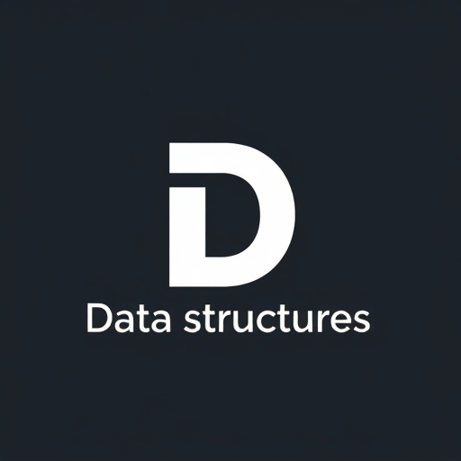

<p align="center">
  
</p>
<h3 align="center"> Data Structures and Algorithms with LeetCode challenges </h3>

## Repository overview 🎨

<strong>DSALearn</strong> - repository where you can learn all about DS and Algorithms, well explained each data structure, practice by leetcode challenges.
<strong>At this moment only in polish version.</strong>

Each structure is tested and described by JSDoc..

For more information, please contact with us!

## Tech/framework used 🧰

| Tech                                                                                                                                              | Description |
| ------------------------------------------------------------------------------------------------------------------------------------------------- | ----------- |
|                           | Logic       |
|                         | Bundler       |
|  | IDE         |
|  | Package Manager         |

## Librares 🧰

| Tech                                                                                                                                              | Description |
| ------------------------------------------------------------------------------------------------------------------------------------------------- | ----------- |
|                          | Testing       |
|                       | Testing       |


## How to install 🎨

```npm
  1. npm install (Install all packages.)
  2. npm run dev (Start to compile project and setup localhost)
  3. Click provided link by localhost.
  4. (Optional) npm run test - run test environment.
```
